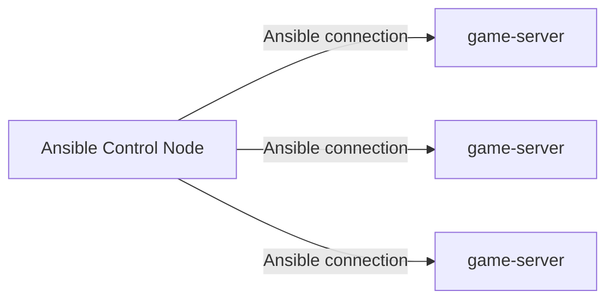

DOJO
=================


DOJO is a state-of-the-art training platform aimed at bolstering cybersecurity
capabilities in the modern era. It focuses on hands-on exercises,
replicating high-risk cyberattack scenarios to offer real-world experience.
Ensuring affordability and ease of deployment, DOJO addresses the prevalent
issues of its predecessors.

- Details are currently being finalized, and more information will be provided soon.

## Contributing to DOJO
If you've discovered a bug, have a feature to suggest, or wish to engage
with the DOJO community, please refer to our [Contribution Guidelines](CONTRIBUTING.md).

## What's DOJO built with

- (To be decided)
- (To be decided)
- (To be decided)

## Getting Started with DOJO

### Pre-Requisites

- `python3.8+`
- `Ubuntu20.04+`
- Other requirements are still being determined.

### Installation from source

Detailed installation instructions will be provided once they're finalized.

## Application Directories

Directories for DOJO on different operating systems will be provided soon.

## Documentation

Comprehensive documentation for DOJO is in the works and will be hosted on GitHub pages.
Link and manual build instructions will be provided in the future.

## Example Notebooks

A curated selection of example notebooks will be available to help users get started
with DOJO. Details about accessing and using these notebooks will be provided soon.

Please write down the IP address or hostname of the Ubuntu 20.04+ host, on which you want to set up the game environment, in the [game-server] section of the inventory.ini file under the playbook.

And, create a pair of private and public keys in /home/user/.ssh/, and name the private key `team.pem` and the public key `team.pub`.

```
$ git clon ehttps://github.com/minihardening/zansin.git
$ cd zanshin/playbook
$ ansible-playbook -i inventory.ini game-servers.yml -K
```

The user connecting must have the permissions to execute sudo, and please enter their password.



## Cite This Work

Details on how to cite DOJO in your academic and professional works will be provided
after our official release.

# License

DOJO is set to be released under an open-source license. Details will be provided in
the [LICENSE](LICENSE) file once finalized.
