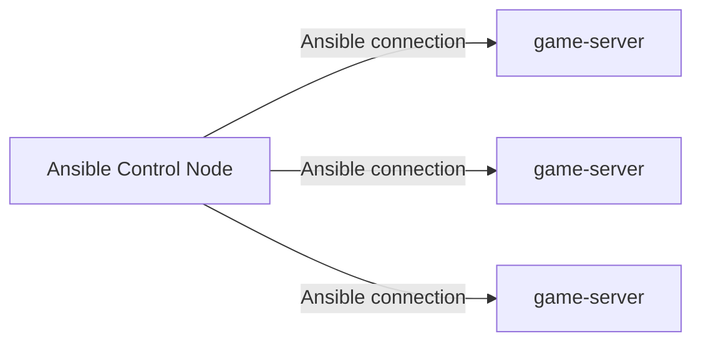

ZANSIN
=================


ZANSIN is envisioned as a GROUNDBREAKING cybersecurity training tool designed to equip users against
the ever-escalating complexity of cyber threats. It achieves this by providing learners
with a platform to engage in simulated cyberattack scenarios, supervised and designed by experienced pentesters.
This comprehensive approach allows learners to actively apply security measures, perform system modifications,
and handle incident responses to counteract the attacks. Engaging in this hands-on practice within realistic
environments enhances their server security skills and provides practical experience in identifying and
mitigating cybersecurity risks. ZANSIN's flexible design accommodates diverse skill levels and learning styles,
making it a comprehensive and evolving platform for cybersecurity education.

- Details are currently being finalized, and more information will be provided soon.
## Getting Started with ZANSIN

### Pre-Requisites

- `Ubuntu20.04+`
- Other requirements are still being determined.

## Example Notebooks

A curated selection of example notebooks will be available to help users get started
with ZANSIN. Details about accessing and using these notebooks will be provided soon.

Please write down the IP address or hostname of the Ubuntu 20.04+ host, on which you want to set up the game environment, in the [game-server] section of the inventory.ini file under the playbook.

And, create a pair of private and public keys in /home/user/.ssh/, and name the private key `team.pem` and the public key `team.pub`.

```
$ git clon https://github.com/zansin-sec/zansin.git
$ cd zanshin/playbook
$ ansible-playbook -i inventory.ini game-servers.yml -K
```

The user connecting must have the permissions to execute sudo, and please enter their password.



## Cite This Work

Details on how to cite ZANSIN in your academic and professional works will be provided
after our official release.

