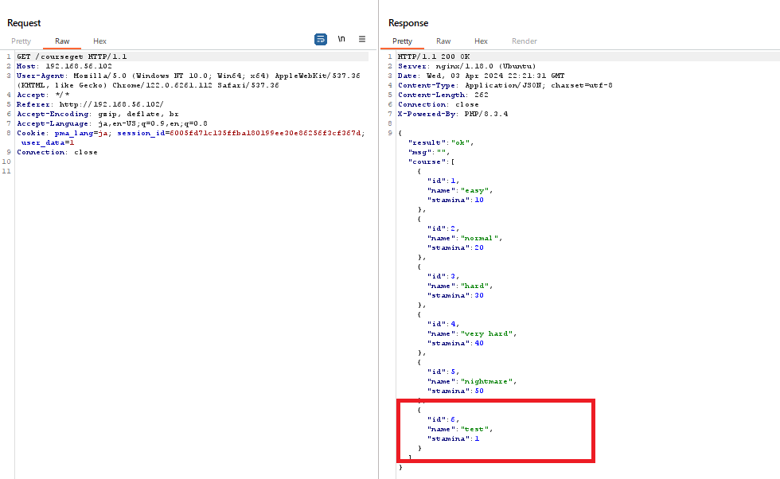
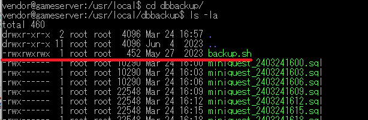
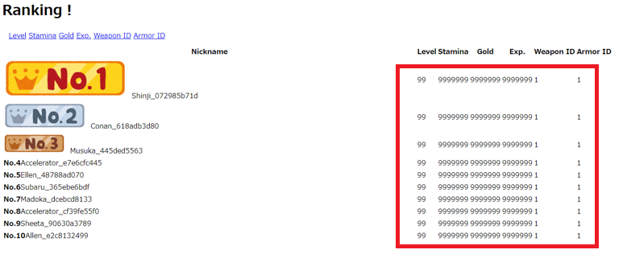
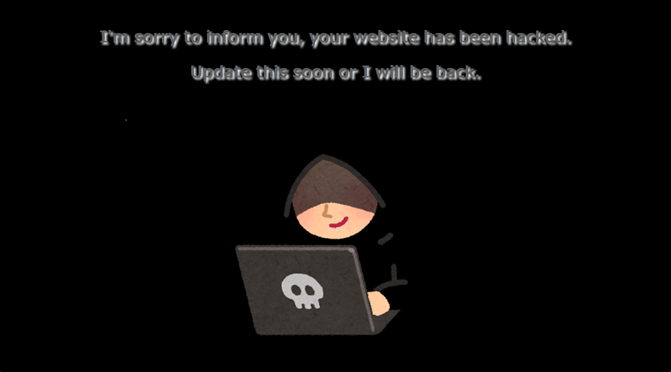

>  [!IMPORTANT]
>  ***This document explains the vulnerabilities of the training machine and the attacks carried out in the exercises, so if you don't want to know the answers to the exercises, please be careful of spoilers.***

# Vulnerabilities in the Traning Machine

The following describes vulnerabilities present in this traning machine and potential mitigation measures.

## Weak Passwords

### Overview

The initial passwords for Linux accounts and MySQL on the training machine will be easy to guess.
This vulnerability makes them highly susceptible to attacks, and if left unattended, they could be exploited.

| Type | Initial Password Value |
| ---- | ---- |
| Linux Account | Passw0rd!23 |
| MySQL | password |
| redis | None |

### Mitigation

* Change to strong passwords.
* Configure settings to prevent or mitigate password cracking.
    - For SSH, enable only public key authentication and implement account lockouts to minimize unauthorized access.
    - Implement access control for services that do not require external exposure

## Unnecessary Service Exposure

### Overview

Each service running in Docker containers lacks access control, and some of these services have exposed ports facing external networks.
This situation exposes the services to potential abuse through open port access.

| Running Service | Port Number |
| ---- | ---- |
| Mysql | 3306 |
| Redis | 6379 |
| phpMyAdmin | 5555 |
| API Debugging Content | 3000 |

### Mitigation

* Implement access control for various ports.
    - Modify docker-compose.yml
    - Control through client-side firewall
* Stop containers for services that are not necessary for service requirements

## Docker Configuration Vulnerability

### Overview

In the game server, the port 2375/TCP used by the Docker API is exposed externally, creating a dangerous situation where third parties can manipulate Docker operations. This vulnerability is being exploited in the exercise to create and launch malicious Alpine Linux container images for attacks.

### Mitigation

* Implement configuration changes and access control for ports.

[Steps for Configuration Changes]   
Modify the following in `/lib/systemd/system/docker.service`
```
ExecStart=/usr/bin/dockerd -H fd:// -H=tcp://0.0.0.0:2375 --containerd=/run/containerd/containerd.sock
↓
ExecStart=/usr/bin/dockerd -H fd:// --containerd=/run/containerd/containerd.sock
```
To apply the new configuration properly, enter the following.
```
sudo systemctl daemon-reload
sudo systemctl restart docker
```
## SQL Injection 

### Overview

There are SQL injection in the login process (`login.php`) and user registration process (`new_user.php`). These vulnerabilities occur because the values passed from clients are directly accepted and used to dynamically generate SQL statements.

`login.php`
```
$user_name = $request_json->user_name; //user input
$password = $request_json->password; // user input
$image = "default.png";

$pdo = connect_db();
$sql = "select * from player where user_name = '$user_name' and password = '$password'";
$login_stmt= $pdo->query($sql);
$row = $login_stmt->fetch(PDO::FETCH_ASSOC);
```

`new_user.php`
```
$user_name = $request_json->user_name; //user input
$password = $request_json->password; // user input
$nick_name = $request_json->nick_name; // user input
$image = "default.png";

$pdo = connect_db();

// Duplicate Check

$dup_stmt = $pdo->query("select count(*) from player where user_name = '$user_name';");
$dup_count = $dup_stmt->fetchColumn();
```

### Mitigation

* Use prepared statements to construct SQL statements.
* Escape input strings.

[Example of PHP Code Modification]  

`login.php`
```
$user_name = $request_json->user_name; //user input
$password = $request_json->password; // user input
$image = "default.png";

$pdo = connect_db();
$sql = "SELECT * FROM player WHERE user_name = :user_name AND password = :password";
$login_stmt = $pdo->prepare($sql);
$login_stmt->bindParam(':user_name', $user_name, PDO::PARAM_STR);
$login_stmt->bindParam(':password', $password, PDO::PARAM_STR);
$login_stmt->execute();
$row = $login_stmt->fetch(PDO::FETCH_ASSOC);
```

`new_user.php`
```
$user_name = $request_json->user_name; //user input
$password = $request_json->password; // user input
$nick_name = $request_json->nick_name; // user input
$image = "default.png";

$pdo = connect_db();

// Duplicate Check

$dup_stmt = $pdo->prepare("SELECT COUNT(*) FROM player WHERE user_name = :user_name");
$dup_stmt->bindParam(':user_name', $user_name, PDO::PARAM_STR);
$dup_stmt->execute();
$dup_count = $dup_stmt->fetchColumn();
```

## Implementation Flaw in Upload an Image Processing

### Overview

There is a vulnerability in the upload an image process (`upload.php`). 
The vulnerability stems from generating the file path simply through string concatenation based on the file name received from clients, leading to a path traversal vulnerability.
Additionally, the process lacks any checks on uploaded files, making it possible to upload arbitrary files. This allows for the upload and execution of arbitrary code, such as PHP files.

`upload.php`
```
$target_file = "./images/players/" . $request_json->file_name;

. . .

try {
    ob_start();
    $file = file_put_contents($target_file, base64_decode($request_json->file_data));
    if ($file) {
        echo json_encode(array("result" => "ok"));
    } else {
        $warning = ob_get_contents();
        ob_end_clean();
        if ($warning) {
            throw new Exception($warning);
        }
        echo json_encode(array(
                "result" => "ng",
                "message" => "unknown error")
        );
    }
} catch (Exception $e) {
    echo json_encode(array(
        "result" => "ng",
        "message" => $e->getMessage()
    ));
}
```

### Mitigation

* Implement Input Validation in the Upload Process(both the File Name and its Extension).

[Example of PHP Code Modification]   

`upload.php`
```
//Relative path validation using basename function
$tmpname = basename($request_json->file_name);

//File name validation
if(preg_match('/^[0-9]*_[0-9]*.[a-z]*$/', $tmpname)){

    //Extension validation
    $allowed_extensions = ['jpg', 'jpeg' ,'png', 'gif'];
    $extension = strtolower(pathinfo($tmpname , PATHINFO_EXTENSION));
    
    if (!in_array($extension, $allowed_extensions)) {
        echo json_encode(array(
            "result" => "ng",
            "msg" => "Unsupported file type. You can only use jpg, png, gif."));
        exit();
    }
}
else{
    echo json_encode(array(
        "result" => "ng",
        "msg" => "The file name format is invalid."));
    exit();
}

$target_file = "./images/players/" . $tmpname;
```

## Authentication-Lacking Admin Panel

### Overview

The admin panel (`user_list.php`) is a page with functionalities for administrators such as user deletion. However, it lacks authentication mechanisms, allowing anyone to access it. This creates the risk of third parties accessing registered user information or unintentionally deleting data.

### Mitigation

* Access control for the admin panel.
    - Add authentication mechanisms (e.g., Basic authentication)
    - Implement IP address restrictions

## Implementation Flaw in Battle Processing

### Overview

In the response of course information retrieval on the battle processing (`course.php`), it is evident that debug monsters, which don't appear on the game screen, exist in the data.
These monsters are present for debugging purposes, so their HP is set low and they provide a very high amount of experience points and gold when defeated. Therefore, by selecting and battling these monsters, it is possible to easily level up.



The parameters passed in the battle processing (`battle.php`) seem to be implemented with the intention of detecting parameter tampering using HMAC. However, there are flaws in the implementation, allowing unauthorized level-ups by manipulating parameter values.

The current code simply compares the HMAC parameter values passed in the HTTP request without actually verifying them, rendering the verification meaningless. Additionally, although there are traces of comparing HMAC values within the program, upon inspecting the check_hmac function, it becomes evident that it is still unimplemented and does not correctly validate the values.

`battle.php`
```
//
// check the hmac
//
// return params:
// general return code
function check_hmac($hmac, $hmac_old) {
  $ret = 1; # I will implement later...
  return $ret;
}
```

### Mitigation

* Restrict input values to ensure that only courses visible on the game screen can be selected.

[Example of PHP Code Modification]  

`course.php`
```
    //Validate range of numbers
    if($request_json->{"id"} < 1 || $request_json->{"id"} > 5){
      $result["msg"] = "invalid number";
      echo json_encode($result);
      exit();
    }
```

* Generate an HMAC value from each parameter received in the request and compare them.

[Example of PHP Code Modification]   

`battle.php`
```
//Additional code start

    unset($enemy_info_json->{"hmac"});
    $enemy_info_array = json_decode(json_encode($enemy_info_json), true);
    ksort($enemy_info_array);
    $einfo_json = json_encode($enemy_info_array);
    // add hmac for prevent falsification
    $cksum = hash_hmac('sha1', $einfo_json, $hmac_secret);
    $enemy_info_json->{"hmac"} = $cksum;
  
    unset($player_info_json->{"hmac"});
    $player_info_array = json_decode(json_encode($player_info_json), true);
    ksort($player_info_array);
    $pinfo_json = json_encode($player_info_array);
    // add hmac for prevent falsification
    $cksum = hash_hmac('sha1', $pinfo_json, $hmac_secret);
    $player_info_json->{"hmac"} = $cksum;

//Additional code end

    // compare the hmac to check correct.
    if(
      ! check_hmac($player_info_json->{"hmac"}, $binfo_current_json->{"player"}->{"hmac"}) ||
      ! check_hmac($enemy_info_json->{"hmac"}, $binfo_current_json->{"enemy"}->{"hmac"})
    ){
      # incorrect hmac
      $lock_flag = 0;
      set_lock_flag($redis, $redis_lock_name, $lock_flag, $max_lock_time, __LINE__);
      $result["msg"] = "The hmac was not correct; line:" . __LINE__;
      echo json_encode($result);
      exit();
    }
```

* Implement the check_hmac function that compares the values passed as arguments and returns True if the values are equal.

[Example of PHP Code Modification]   

`battle.php`
```
function check_hmac($hmac, $hmac_old) {
  if($hmac===$hmac_old){
    return 1;
  }else{
    return 0;
  }
}
```

## Implementation Flaw in Gacha Processing

### Overview

In the Gacha processing, there is no validation for the amount of payment made. Therefore, it is possible to draw from the gacha without paying the specified amount by tampering with the HTTP request parameter values.

`gacha.php`
```
//subtract payment from current gold 
$result_gold = $current_gold - $post_gold;
```

### Mitigation

* Implement input validation for the payment amount parameter value.

[Example of PHP Code Modification]  

`gacha.php`
```
//Validate the value of post value
if($post_gold !== 100 ) {
    echo json_encode(array(
        "result" => "ng",
        "msg" => "The sent gold value is invalid."
    ));
    exit();
}
```

## BOLA(Broken Object Level Authorization) in Player Data Screen

### Overview

In the login process (`login.php`), a value called user_data associated with the user is set in a cookie.

`login.php`
```
// Get User Data
$user_cookie_data = $user_id;

setcookie('session_id', $session_id);
setcookie('user_data', $user_cookie_data);
```

The player data screen (`player.php`) is implemented to display the player's own information in the game.
But actually, this API includes a debugging function that uses a user_data which intends to get other players' information.

`player.php`
```
// check login status
// checking "user_data" is for debbuging only!
// checking "session_id" is mandatory!
if (isset($_COOKIE['user_data'])) {
    $user_id = $_COOKIE['user_data'];
} elseif (isset($_COOKIE['session_id'])) {
    $session_id = $_COOKIE['session_id'];
    $user_id = check_login($redis, $session_id);    
} else {
    echo json_encode(array(
        "result" => "ng",
        "msg" => "Session ID is required."));
    exit();
}
```

By manipulating the value of user_data, it is possible to view the player data screen of other game users linked to that user_data value.

Although the response data from the player data screen is not shown on the screen, it is designed to also output password value. This vulnerability could be exploited to hijack game user accounts.

`player.php`
```
// obtain the player data from DB
$pdo = connect_db();
$stmt = $pdo->prepare("SELECT * FROM player where id =:id;");
$stmt->bindValue(':id', $user_id, PDO::PARAM_INT);
$stmt->execute();
$userData = array();
$rows_found = false;
while ($row = $stmt->fetch(PDO::FETCH_ASSOC)) {
    $rows_found = true;
    $userData =[
        'id' => $row['id'],
        'user_name' => $row['user_name'],
        'password' => $row['password'],
        'nick_name' => $row['nick_name'],
        'image' => $row['image'],
        'level' => $row['level'],
        'stamina' => $row['stamina'],
        'weapon_id' => $row['weapon_id'],
        'armor_id' => $row['armor_id'],
        'gold' => $row['gold'],
        'exp' => $row['exp'],
        'created_at' => $row['created_at'],
        'staminaupdated_at' => $row['staminaupdated_at']
    ];
}
```

### Mitigation

* Modify the player data screen to identify users based only on the value of the session_id cookie.

[Example of PHP Code Modification]  

`player.php`
```
if (isset($_COOKIE['session_id'])) {
    $session_id = $_COOKIE['session_id'];
    $user_id = check_login($redis, $session_id);    
} else {
    echo json_encode(array(
        "result" => "ng",
        "msg" => "Session ID is required."));
    exit();
}
```

* Modify the player data screen response to not output password strings (fundamentally, the handling of passwords should be revised to not store them in plain text).

[Example of PHP Code Modification] 

`player.php`
```
$userData =[
        'id' => $row['id'],
        'user_name' => $row['user_name'],
        'password' => "********",
        'nick_name' => $row['nick_name'],
        'image' => $row['image'],
        'level' => $row['level'],
        'stamina' => $row['stamina'],
        'weapon_id' => $row['weapon_id'],
        'armor_id' => $row['armor_id'],
        'gold' => $row['gold'],
        'exp' => $row['exp'],
        'created_at' => $row['created_at'],
        'staminaupdated_at' => $row['staminaupdated_at']
    ];
```

## OS Command Injection in Debugging Content

### Overview

The API debugging content running on 3000/TCP has a vulnerability related to OS command injection. If this content is left exposed, there is a risk of remote code execution. Furthermore, upon inspecting the docker-compose.yml, it is evident that the container (`apidebug`) running the API debugging content has the privileged option set.

This configuration poses a significant risk as it allows potential exploitation of OS command injection on the container, leading to arbitrary command execution with root privileges on the host.

### Mitigation

* Since this container service is not necessary for the game service, consider stopping the container or implementing access controls for the ports to mitigate the risk.

## Inadequate Permission Settings for Backup Script

### Overview

Within the server, there is a MySQL backup script named `dbbackup.sh` located at `/usr/local/dbbackup`, and it is scheduled to run regularly with root user privileges using cron. 
In addition, the permission of this shell script set to "777".
This means that if an attacker gains access to the server and writes arbitrary commands to dbbackup.sh, those commands will be executed with root user privileges, potentially leading to privilege escalation.



### Mitigation

* Modify the permissions (change to appropriate permissions such as "700").

To set the appropriate permissions, enter the following.
```
sudo chmod 700 dbbackup.sh
```

# Attack Scenario in Exercises

Below is an outline of the attacks conducted during the exercises and the anticipated interim measures if an attack occurs.

Utilizing the vulnerabilities explained above, the exercises execute the attacks described below. The fundamental solution to each attack is to fix the vulnerabilities mentioned above that cause the attacks. If the vulnerabilities were fixed before the attack, there would naturally be no impact from the attack.

## Installation of Backdoor

### Overview

After gaining access to the system using vulnerabilities, the following backdoors are set up to execute further attacks:

* Installation of WebShell
* Creation of unauthorized user (wario)
* Regular execution of reverse shell using cron
* Privilege escalation through the addition of files to the sudoers.d directory
* Installation of public keys for forced SSH login (root, www-data, nobody, sonic)

By using the mentioned backdoors, attackers can remotely manipulate the game system.

### Example Response if Attacked

* Removal of each item set as a backdoor.
* Stopping suspicious processes like reverse shell.

## Installation of Malware

### Overview

After gaining access to the system using vulnerabilities and if root privileges are obtained, malware that communicates with the attacker's C&C server via the DNS protocol will be installed on the server.

```
/var/tmp/systemd-private-journal
/var/tmp/systemd-private-journal-zWuKif
/etc/systemd/system/systemd-journal.service
```

The malware operates as a service in systemd (`systemd-journal.service`) and performs polling every 60 seconds via the DNS protocol to C&C server. By using this malware, attackers can remotely access the Game server with root privileges.

### Example Response if Attacked

* Stop the malware service and remove the installed malware.

## Execution of Game Cheats

### Overview

Exploiting vulnerabilities to carry out cheating activities such as:

* Mass registration of unauthorized cheat users.
* Illegitimate stat boosts exploiting bugs.

If cheat users appear in the game rankings, the scoring mechanism will increase their access interval based on the crawler's detection, which leads to a decrease in the final score.



### Response if Attacked

* Removal of suspicious users.

## Website Tampering

### Overview

Upon successful installation of malware settings or backdoors, website tampering is executed. 
When the site is tampered with, crawlers detect it as not meeting SLA and increase the access interval, which leads to a decrease in the final score.



### Response if Attacked

* Revert to the content before tampering.

## Deletion of Legitimate Users

### Overview

If vulnerabilities such as missing authentication in the admin panel and BOLA in player data screen are left unattended, there may be attacks to delete legitimate users exploiting these vulnerabilities

### Response if Attacked

* Users deleted due to this attack cannot be restored.

## Database deletion

If SQL injection are left unattended, there is a risk of attacks exploiting SQL injection to delete game databases. 
If the game is not functioning properly, crawlers will not be able to access it properly, which leads to a decrease in the final score.

### Response if Attacked

* Recovery using backed-up database files(The files under /usr/local/dbbackup directory might be useful).
