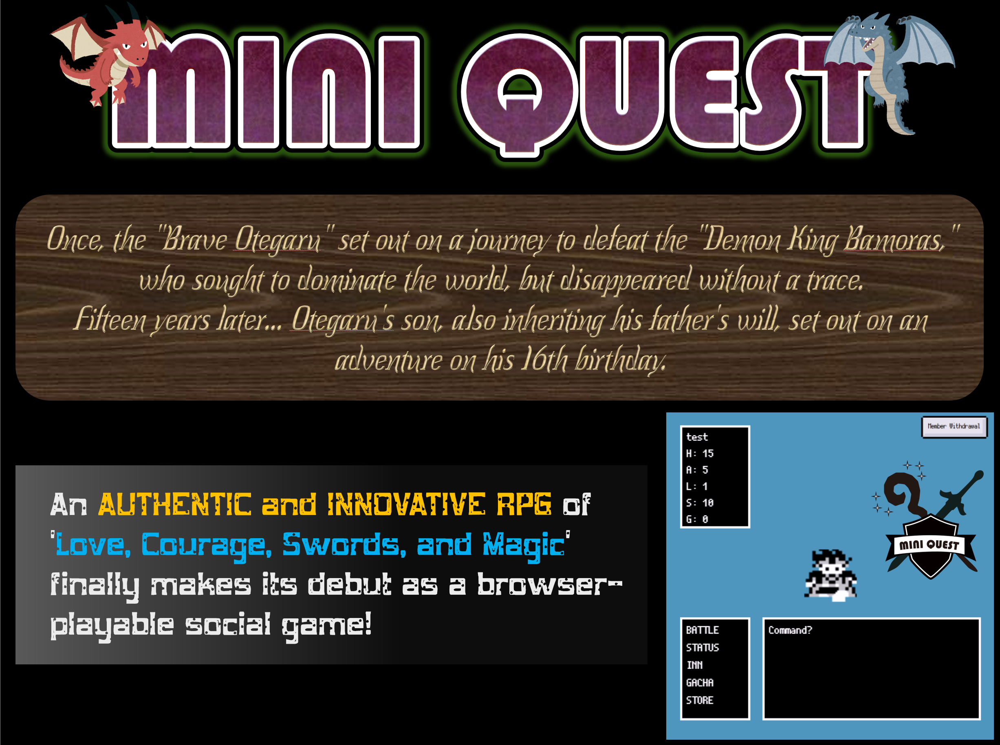
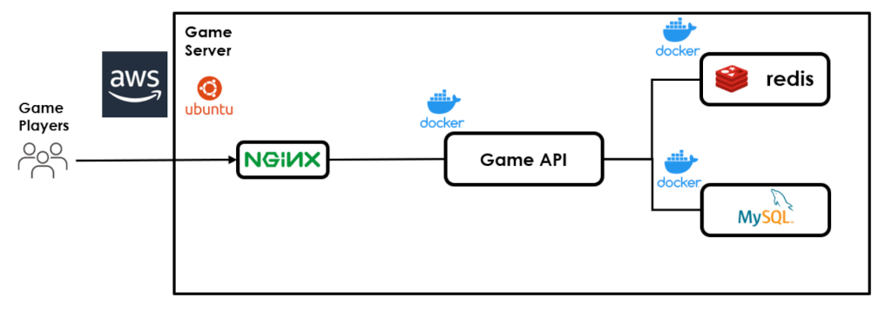
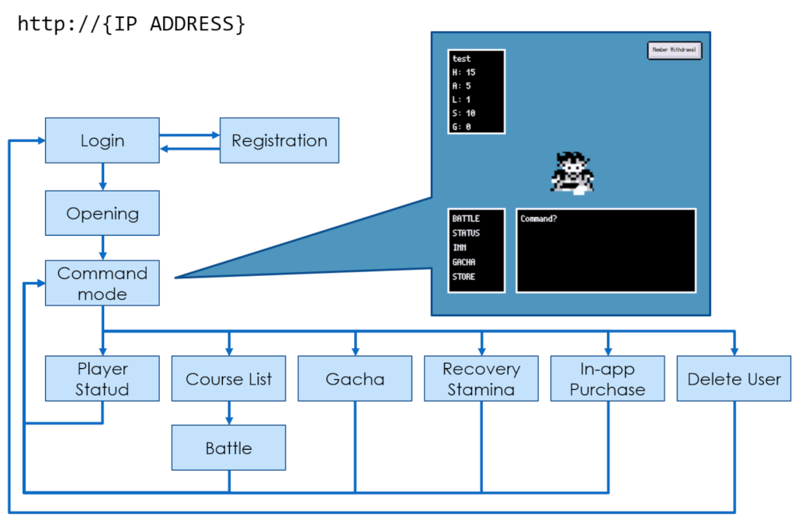
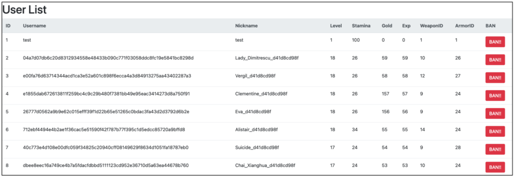
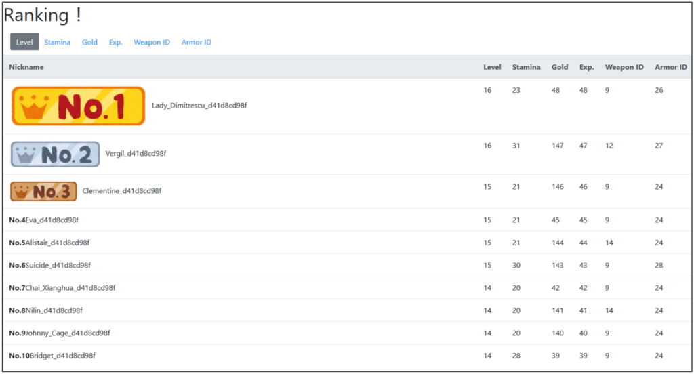

# Prologue

Once upon a time, there was an entrepreneur who dreamed of making a fortune. Having experienced several business failures in the past, he decided to launch an online gaming company as his new venture.

Being an authoritarian president, he himself came up with game concepts and designs, hired development partners at a very low cost, and managed to launch the service.

In such circumstances, you were hired by this company as personnel to operate the system continuously.

# MINI QUEST

The name of the launched online game is "MINI QUEST."

Inspired by Japan's immensely popular role-playing game that debuted in 1986, modern mechanisms such as a gacha system for acquiring rare items and a monetization system for purchasing in-game currency have been incorporated.

# Mission

Your mission during this exercise is to ensure the stable operation of this game system and strive to generate revenue.

However, cyber attacks and game cheating behaviors will be directed towards the online game servers that you must manage.

In an online game where cyber attacks and cheating behaviors are prevalent, such as data tampering on the online game server, service interruptions, and frequent cheating incidents, legitimate users decrease, resulting in an inability to generate profits.

You must rigorously implement the following to consistently generate revenue:

- Protect the server from cyber attacks.
- Safeguard the game from cheating behaviors.

In this exercise, the ZANSIN Scoring Module will evaluate whether the root causes of vulnerabilities on the server have been addressed. 

Therefore, rather than resorting to ad hoc measures against cyberattacks or in-game cheating, let's concentrate on addressing vulnerabilities.

The attacks in the excercise will conclude in **4 hours**. 

Please perform fixing vulnerabilities and incident response during the 4-hour period since the exercise began, striving to achieve a high score.

# Excercise Environment

The structure of the online game server is as follows:
Various APIs are implemented using Docker within the ZANSIN Training Machine.

# Game APIs

The APIs implemented in the online game are as follows:

- User Registration API
- Login API
- Withdrawal API
- Player Data API
- Upload an Image API
- Battle Course List API
- Determination of the Battle Course API
- Battle API
- Stamina Recovery API
- Gatcha API
- In-game purshase API
- Ranking API

The API reference is available for download from the following link.

- [API Refarence](../documents/API_Reference.pdf)

# Browser Game - "MINI QUEST"

When accessing the online game itself, you simply need to access the IP address of the online game server using HTTP (port 80/tcp).

`http://{IP ADDRESS}`

> [!NOTE]
> If HTTP is blocked by a firewall, port forwarding may be required to access the game through a browser.

## State Transition Diagram of MINI QUEST

The progression of the game screen is as follows:

## Admin Panel

As the administrator of the online game server, you have the ability to manage game players.

`http://{IP ADDR}/user_list/`

If there is a player engaging in unauthorized cheating behavior, you can remove that player by using the "BAN!!" button.

## User Ranking

This page allows you to check which players are performing well.
As this page is a public page, it should be accessible to everyone.

`http://{IP ADDRESS}/ranking/`

# Reference of MINI QUEST Server

- Credentials on ZANSIN Training Machine
  |Account Name|Password|Note|
  |----|----|----|
  |vendor|Passw0rd!23|You have to use this!! You can use `sudo`.|
  |mario|Passw0rd!23||
  |link|Passw0rd!23||
  |sonic|Passw0rd!23||

- Services
  |Service|Note|
  |----|----|
  |SSH| credential: `vendor`/`Passw0rd!23`|
  |MySQL| credential: `root` / `password`|
  |HTTP| Game Page: http://{IP ADDRESS} Admin Page: http://{IP ADDRESS}/user_liset/ User Ranking: http://{IP ADDRESS}/ranking/ phpMyAdmin: http://{IP ADDRESS}:5555|

- Game API
  - You can fined the source code in the folloing path;
    - `/home/vendor/game-api`
  - If you want to up / down the containers for Game APIs, please see the below;
    - Start the containers
      - `docker-compose up -d`
    - Stop the containers
      - `docker-composer down`

# Prohibited Actions

- **Access Control**
  - Avoid blocking connections from the ZANSIN Control Server based on the source IP address. 
    - Both legitimate user and attacker connections originate from the same IP address of the ZANSIN Control Server. Blocking it would prevent access by the ZANSIN Crawling Module and Scoring Module to your service, rendering score evaluation impossible.
    - Similarly, please be careful not to disrupt communication from both the ZANSIN Crawling Module and ZANSIN Scoring Module, as this could results in decreased revenue for the game server and inaccurate evaluations.
- **API**
  - Maintain the JSON structure in the API response.
    - You may modify or remove values in the API responses, but refrain from altering keys as this would hinder the ZANSIN Crawling Module's ability to retrieve the response.