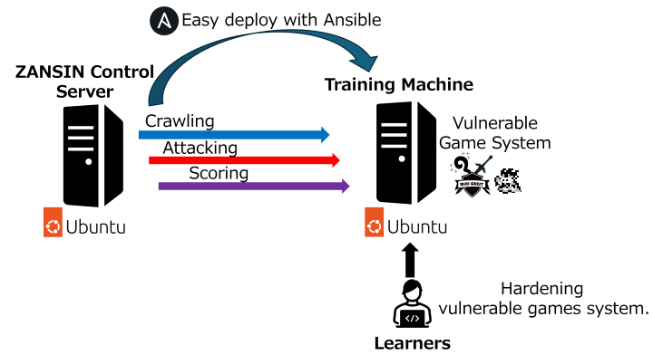

# System Overview

## Overview
ZANSIN offers a comprehensive training environment for learning cybersecurity.\
Through this exercise, learners will experience a realistic cyber security incident and learn the experience of identifying and defending against cyber security risks.

The system utilizes Ansible for easy setup of the environment, allowing efficient preparation. \
Once the exercises begin, learners can access a web-browser-based game system with intentional vulnerabilities. They need to strengthen their own training machines while responding to cyber-attacks from the control server to protect the system.

## Components

### Control Server:
Roles:
- **Crawling**: The crawler simulates access to the game system on the training machine by a legitimate game user. The crawler periodically accesses the game system during exercises to check if it's functioning correctly, aggregating results to evaluate the duration the game system operated normally during the exercise.
- **Attack**: Executes cyber-attacks based on attack scenarios against vulnerabilities in the training machine.
- **Scoring**: Evaluate whether vulnerabilities on the training machine have been correctly fixed.

### Training Machine:
Roles:
- Learners can access the game system, which contains vulnerabilities.

## Workflow
1. Initially, set up the environment. Prepare two virtual machines (Ubuntu) and download tools from the ZANSIN repository on GitHub. Execute the Ansible command to set up the control server and training machine.
2. Learners access the training machine, where the vulnerable game system is operational.
3. Once the exercise begins, the control server's crawler simulates legitimate game users by periodically checking if the game system is functioning correctly. The control server then executes cyber attacks against vulnerabilities in the training machines based on attack scenarios.
4. Learners must keep the system operational while responding to cyber-attacks. They also need to identify and fix vulnerabilities in the game system.
5. At the end of the exercise, the control server evaluates the time the game system operated correctly and how much the vulnerabilities in the training machine were fixed, assessing the learners' ability to respond to cyber-attacks.

